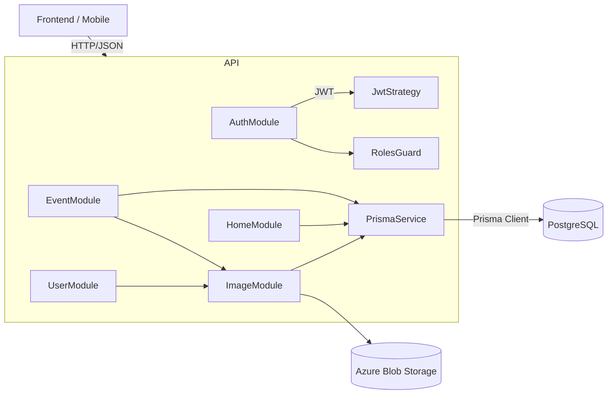

<p align="center">
  <a href="http://nestjs.com/" target="blank"></a>
</p>

[circleci-image]: https://img.shields.io/circleci/build/github/nestjs/nest/master?token=abc123def456
[circleci-url]: https://circleci.com/gh/nestjs/nest

  <p align="center">A progressive <a href="http://nodejs.org" target="_blank">Node.js</a> framework for building efficient and scalable server-side applications.</p>
    <p align="center">
<a href="https://www.npmjs.com/~nestjscore" target="_blank"></a>
<a href="https://www.npmjs.com/~nestjscore" target="_blank"></a>
<a href="https://www.npmjs.com/~nestjscore" target="_blank"></a>
<a href="https://circleci.com/gh/nestjs/nest" target="_blank"></a>
<a href="https://discord.gg/G7Qnnhy" target="_blank"></a>
<a href="https://opencollective.com/nest#backer" target="_blank"></a>
<a href="https://opencollective.com/nest#sponsor" target="_blank"></a>
  <a href="https://paypal.me/kamilmysliwiec" target="_blank"></a>
    <a href="https://opencollective.com/nest#sponsor"  target="_blank"></a>
  <a href="https://twitter.com/nestframework" target="_blank"></a>
</p>
  <!--[](https://opencollective.com/nest#backer)
  [](https://opencollective.com/nest#sponsor)-->

## Descrição

API NestJS para gestão de usuários e eventos (CRUD completo), com autenticação JWT, papéis (USER/ADMIN), inscrições em eventos e endpoint inicial de `home`. Banco baseado no diagrama incluído (`db_diagram.png`) e Prisma ORM.

## Stack

- **NestJS 11**, **TypeScript**, **Prisma** (PostgreSQL), **JWT**, **argon2**
- Validação com `class-validator`, Guards de `JWT` e `Roles`
- Upload de imagens via **Azure Blob Storage**

## Setup do projeto

```bash
$ npm install
```

## Executar (dev)

```bash
# development
$ npm run start

# watch mode
$ npm run start:dev

# production mode
$ npm run start:prod
```

## Banco de Dados (Prisma)

1) Configure `DATABASE_URL` no `.env` (ou suba via `docker-compose.yml`).
2) Rode as migrações e gere o client:

```bash
npx prisma migrate dev
npx prisma generate
```

3) Seed de ADMIN (usa `ADMIN_EMAIL`, `ADMIN_PASSWORD`, `ADMIN_NAME` se presentes):

```bash
npm run db:seed
```

## Endpoints principais

- Autenticação
  - POST `/auth/signup` { email, password, name?, matricula? }
  - POST `/auth/signin` { email, password }
  - POST `/auth/change-password` (JWT) { currentPassword, newPassword }
  - POST `/auth/forgot` { email }  // stub seguro
  - POST `/auth/reset` { token, newPassword } // stub seguro
- Usuário
  - GET `/users/me` (JWT)
  - PATCH `/users` (JWT)
- Home
  - GET `/home`  → próximos eventos
- Eventos
  - GET `/events`
  - GET `/events/:id`
  - POST `/events` (JWT + ADMIN)
  - PATCH `/events/:id` (JWT + ADMIN e criador)
  - DELETE `/events/:id` (JWT + ADMIN e criador)
  - POST `/events/:id/register` (JWT)
  - DELETE `/events/:id/register` (JWT)
  - GET `/events/:id/registrations` (JWT + ADMIN)
- Imagens
  - POST `/images` (JWT) → multipart `file` enviado para Blob Storage e persistido no banco
  - GET `/images/:id`
  - DELETE `/images/:id` (JWT + ADMIN)

## Modelos de Dados (Prisma)

Modelos implementados conforme o diagrama:

```mermaid
erDiagram
  User ||--o{ Event : "cria (adminId)"
  User ||--o{ EventRegistration : "inscreve"
  Event ||--o{ EventRegistration : "tem inscrições"
  Image ||--o| Event : "capa (imageId)"
  Image ||--o| User : "avatar (avatarImageId)"

  User {
    string id PK
    string name
    string email UK
    string matricula UK
    string passwordHash
    enum RoleEnum
    datetime createdAt
    datetime updatedAt
    string? avatarImageId FK -> Image.id
  }

  Event {
    string id PK
    string title
    string description
    datetime startTime
    datetime endTime
    string location
    string? imageId FK -> Image.id
    string? lecturers
    string adminId FK -> User.id
  }

  EventRegistration {
    string userId FK -> User.id
    string eventId FK -> Event.id
    datetime registeredAt
    PK "userId,eventId"
  }

  Image {
    string id PK
    string originalName
    string mimeType
    int size
    string blobName UK
    string url
    datetime createdAt
    datetime updatedAt
  }
```

## Casos de Uso

```mermaid
flowchart TD
  A[Usuário Anônimo] -->|Cadastrar| UC_Signup[UC: Cadastrar]
  A -->|Login| UC_Signin[UC: Login]
  A -->|Listar Eventos| UC_ListEvents[UC: Listar Eventos]

  B[Usuário Autenticado (ROLE=USER)] -->|Ver Detalhes| UC_ViewEvent[UC: Ver Evento]
  B -->|Inscrever-se| UC_Register[UC: Inscrever-se em Evento]
  B -->|Cancelar Inscrição| UC_Unregister[UC: Cancelar Inscrição]
  B -->|Alterar Senha| UC_ChangePass[UC: Alterar Senha]

  C[Administrador (ROLE=ADMIN)] -->|Criar| UC_CreateEvent[UC: Criar Evento]
  C -->|Editar| UC_UpdateEvent[UC: Editar Evento]
  C -->|Excluir| UC_DeleteEvent[UC: Excluir Evento]
  C -->|Ver Inscritos| UC_ListRegs[UC: Listar Inscrições do Evento]
```

## Arquitetura do Sistema



## Segurança e Autorização

- Autenticação por JWT (Bearer) com expiração curta.
- `RolesGuard` checa `role` do usuário (ADMIN/USER) para rotas administrativas.
- Senhas com `argon2`.

## Variáveis de Ambiente

- `DATABASE_URL`: conexão PostgreSQL
- `JWT_SECRET`: segredo para assinatura do token
- `PORT`: porta da API (default 30001)
- `ADMIN_EMAIL`, `ADMIN_PASSWORD`, `ADMIN_NAME`: seed do admin
- `AZURE_STORAGE_CONNECTION_STRING`: string de conexão do Azure Blob Storage
- `AZURE_STORAGE_CONTAINER`: (opcional) container utilizado para armazenar imagens (`images` por padrão)

## Scripts úteis

```bash
npm run start:dev          # iniciar em dev
npx prisma migrate dev     # aplicar migrações
npx prisma generate        # gerar client
npm run db:seed            # rodar seed (admin)
```

```bash
# unit tests
$ npm run test

# e2e tests
$ npm run test:e2e

# test coverage
$ npm run test:cov
```

## Deployment

When you're ready to deploy your NestJS application to production, there are some key steps you can take to ensure it runs as efficiently as possible. Check out the [deployment documentation](https://docs.nestjs.com/deployment) for more information.

If you are looking for a cloud-based platform to deploy your NestJS application, check out [Mau](https://mau.nestjs.com), our official platform for deploying NestJS applications on AWS. Mau makes deployment straightforward and fast, requiring just a few simple steps:

```bash
$ npm install -g @nestjs/mau
$ mau deploy
```

With Mau, you can deploy your application in just a few clicks, allowing you to focus on building features rather than managing infrastructure.

## Resources

Check out a few resources that may come in handy when working with NestJS:

- Visit the [NestJS Documentation](https://docs.nestjs.com) to learn more about the framework.
- For questions and support, please visit our [Discord channel](https://discord.gg/G7Qnnhy).
- To dive deeper and get more hands-on experience, check out our official video [courses](https://courses.nestjs.com/).
- Deploy your application to AWS with the help of [NestJS Mau](https://mau.nestjs.com) in just a few clicks.
- Visualize your application graph and interact with the NestJS application in real-time using [NestJS Devtools](https://devtools.nestjs.com).
- Need help with your project (part-time to full-time)? Check out our official [enterprise support](https://enterprise.nestjs.com).
- To stay in the loop and get updates, follow us on [X](https://x.com/nestframework) and [LinkedIn](https://linkedin.com/company/nestjs).
- Looking for a job, or have a job to offer? Check out our official [Jobs board](https://jobs.nestjs.com).

## Support

Nest is an MIT-licensed open source project. It can grow thanks to the sponsors and support by the amazing backers. If you'd like to join them, please [read more here](https://docs.nestjs.com/support).

## Stay in touch

- Author - [Kamil Myśliwiec](https://twitter.com/kammysliwiec)
- Website - [https://nestjs.com](https://nestjs.com/)
- Twitter - [@nestframework](https://twitter.com/nestframework)

## License

Nest is [MIT licensed](https://github.com/nestjs/nest/blob/master/LICENSE).
